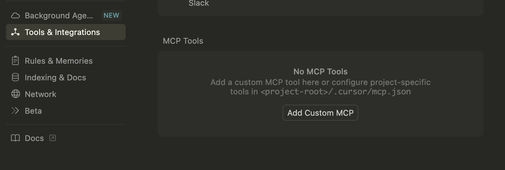
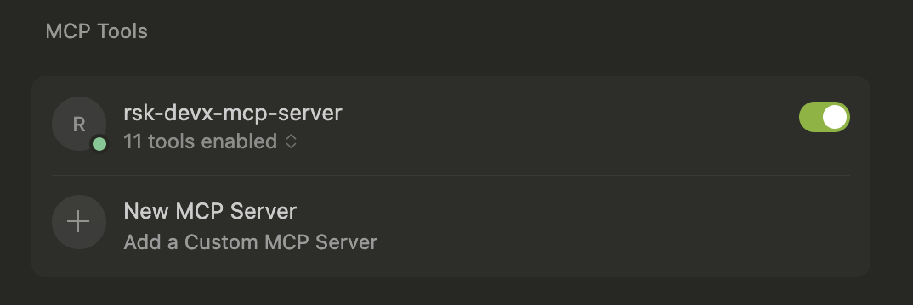
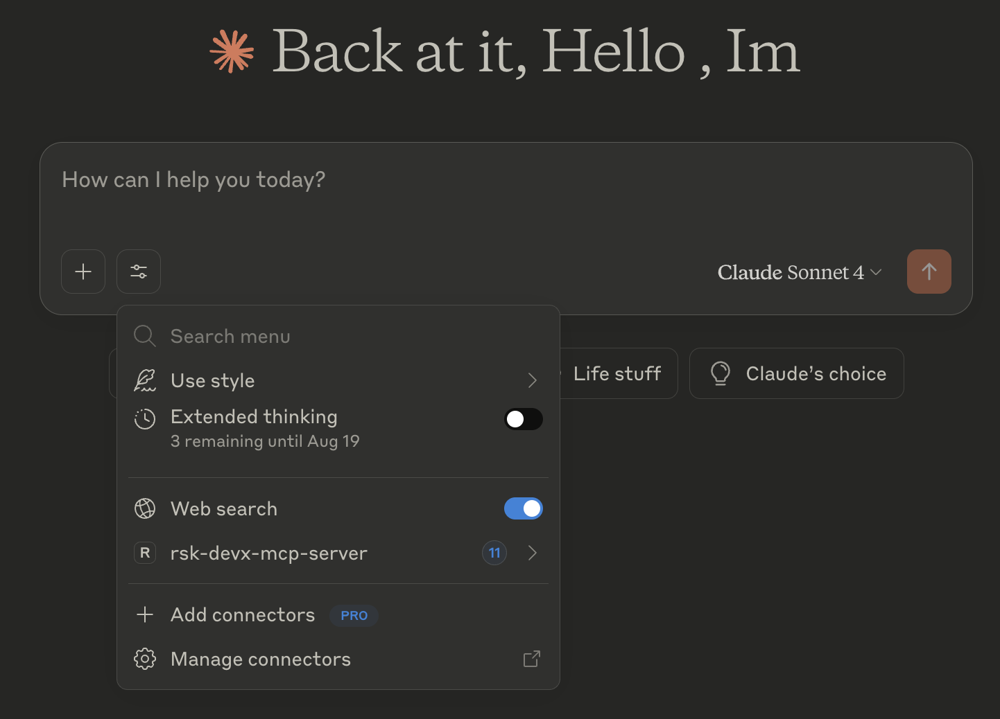

[](https://scorecard.dev/viewer/?uri=github.com/rsksmart/rsk-mcp-server)
[](https://github.com/rsksmart/rsk-mcp-server/actions?query=workflow%3ACodeQL)


# DevX MCP Server - Rootstock Blockchain Tools

**Rootstock MCP Server** is a Model Context Protocol (MCP) server that provides advanced tools for interacting with the Rootstock (RSK) blockchain. This project enables AI clients to seamlessly connect and execute blockchain operations.

## 🚀 Key Features

- 💼 **Wallet Management**: Create, import, switch and manage multiple wallets
- 💰 **Balance Queries**: Check rBTC and ERC20 token balances
- 💸 **Transfers**: Send rBTC and tokens to other addresses
- 🔍 **Transaction Tracking**: Verify transaction status by hash
- 🚀 **Contract Deployment**: Deploy smart contracts on Rootstock
- ✅ **Contract Verification**: Verify deployed contracts
- 📄 **Contract Interaction**: Read data from verified contracts
- 🌉 **RSK Bridge**: Interact with the Rootstock bridge
- 📊 **History**: Query transaction history
- 📦 **Batch Transfers**: Execute multiple transfers

## 📋 Prerequisites

- **Node.js** v18 or higher
- **npm** or **yarn**
- **TypeScript** (included in dev dependencies)

> **Note:** You will use this Model Context Protocol Server from a LLM Client (e.g Cursor, Claude, Warp, etc) which needs to be compatible with the MCP standard. Take into account there are 2 steps here:
> 1. Installation and Build
> 2. AI Client Configuration

IMPORTANT: You need to complete both settings to correctly use MCP within the Client.


## 🛠️ Installation and Build

### 1. Clone the Repository

```bash
git clone https://github.com/rsksmart/rsk-mcp-server
cd rsk-mcp-server
```

### 2. Install Dependencies

```bash
npm install
```

### 3. Build the Project

```bash
npm run build
```

This command:
- Compiles TypeScript to JavaScript in the `build/` folder
- Makes the main file executable (`build/index.js`)

### 4. Verify Installation

```bash
node build/index.js
```

> **Important Note:** For local running this MCP, your client will point to the `index.js` file created on the `build` folder after building it.

## ⚙️ AI Client Configuration

### 🏠 Local Configuration

### For Cursor IDE

In Cursor, go to Settings > Cursor Settings > Tools & Integrations 

You will see an option to `Add Custom MCP`


And add to the JSON file:
```json
{
  "mcpServers": {
    "rsk-mcp": {
      "command": "node",
      "args": ["/absolute/path/to/your/project/rsk-mcp-server/build/index.js"]
    }
  }
}
// The Args field contains the path to the index.js file created by the build.
```
> **Note:** For install reference on Cursor, please follow these instructions [Here](https://docs.cursor.com/en/context/mcp)

Once it is installed into Cursor, you should see something like:


Green dot indicates it was installed correctly.

### For Claude Desktop (Anthropic)

Edit your Claude Desktop configuration file:

Open your Claude client, and then click on Settings/Developer 


Click the “Edit Config” button to open the configuration file and add the following configuration:

> **Note:**  This action creates a new configuration file if one doesn’t exist, or opens your existing configuration. The file is located at:

- macOS: `~/Library/Application Support/Claude/claude_desktop_config.json`
- Windows: `%APPDATA%\Claude\claude_desktop_config.json`

```json
{
  "mcpServers": {
    "rsk-mcp": {
      "command": "node",
      "args": ["/absolute/path/to/your/project/rsk-mcp-server/build/index.js"],
      "env": {}
    }
  }
}
// The Args field contains the path to the index.js file created by the build.
```
> **Note:** For install reference on Claude, please follow these instructions [Here](https://modelcontextprotocol.io/quickstart/user)

Once you have installed this MCP on the Claude client, you will see it once you click on the `Search and tools`option under Web search option (see next image)



### For Other MCP Implementations

Any MCP-compatible client can connect using:

```bash
node /path/to/project/DevXMcp/build/index.js
```

### 🌐 Remote Configuration (URL)

> **Note:** This functionality will be available when the server is deployed to a public endpoint.

#### Remote Client Configuration

```json
{
  "mcpServers": {
    "rsk-mcp": {
      "url": "https://your-server.com/mcp-endpoint",
      "headers": {
        "Authorization": "Bearer your-api-key"
      }
    }
  }
}
```
## 🔧 Detailed Functionality

Once this MCP is installed on the client, you will be able to interact with it by prompt, using chat box, for example, a good prompt to start interacting with this MCP is to write a prompt like:
`I would like to start interacting with Rootstock`

Then it will require you to give permission to use the MCP tool, you click on accept, and then it should answer something like:

```
Perfect! The Rootstock CLI is now active and ready to help you interact with the Rootstock blockchain. Here are the available options:
Available Rootstock Operations:
💼 wallet - Manage your wallet (create new, use existing, or import)
💰 balance - Check wallet balances
💸 transfer - Transfer RBTC or ERC20 tokens
🔍 tx - Check transaction status
🚀 deploy - Deploy a smart contract
✅ verify - Verify a contract
📄 contract - Interact with a contract
🌉 bridge - Interact with RSK bridge
📊 history - Check transaction history
📦 batch-transfer - Execute batch transactions
❓ help - Display help
What would you like to do? If you don't have a wallet yet, I'd recommend starting with option 1 (wallet management) to create or import a wallet first. Then you can proceed with other operations like checking balances, transferring tokens, or deploying contracts.
Which option interests you?
```

You can continue the flow according to what you need to do.

### 1. 💼 Wallet Management

#### Available Tools:
- `start-wallet-interaction`: Initialize wallet management
- `create-wallet`: Create/import/manage wallets

#### Supported Operations:

**🆕 Create New Wallet**
```typescript
// Creates a wallet with secure password
{
  walletOption: "🆕 Create a new wallet",
  walletName: "MyWallet",
  walletPassword: "secure_password",
  replaceCurrentWallet: false
}
```

**🔑 Import Existing Wallet**
```typescript
// Import using private key
{
  walletOption: "🔑 Import existing wallet",
  walletName: "ImportedWallet",
  privateKey: "0x...",
  walletPassword: "secure_password"
}
```

**🔍 List Saved Wallets**
```typescript
// List all available wallets
{
  walletOption: "🔍 List saved wallets",
  walletData: "my-wallets.json_content"
}
```

**🔁 Switch Active Wallet**
```typescript
// Switch to another wallet
{
  walletOption: "🔁 Switch wallet", 
  newMainWallet: "WalletName"
}
```

### 2. 💰 Balance Queries

#### Tool: `check-balance`

**Supported Tokens:**
- **rBTC** - Rootstock native token
- **USDT** - Tether USD 
- **DOC** - Dollar on Chain
- **BPRO** - BitPro
- **RIF** - RIF Token
- **FISH** - Fish Token
- **Custom Token** - Any ERC20 token

**Example:**
```typescript
{
  testnet: true, // true for testnet, false for mainnet
  token: "rBTC",
  walletName: "MyWallet" // optional, uses current wallet if not specified
}
```

**For Custom Tokens:**
```typescript
{
  testnet: true,
  token: "Custom Token",
  customTokenAddress: "0x...", // token contract address
  walletName: "MyWallet"
}
```

### 3. 🔍 Transaction Tracking

#### Tool: `check-transaction`

```typescript
{
  testnet: true, // network to check
  txid: "0x..." // transaction hash (with or without 0x prefix)
}
```

**Returned Information:**
- Transaction status (pending/confirmed/failed)
- Block number
- Gas used
- Transfer details
- Timestamps

### 4. 🚀 Contract Deployment

#### Tool: `deploy-contract`

**Requirements:**
- Contract ABI (JSON)
- Compiled bytecode (hex)
- Constructor arguments (optional)
- Wallet with sufficient funds

**Example:**
```typescript
{
  testnet: true,
  abiContent: `[{"inputs":[],"name":"myFunction"...}]`, // complete ABI
  bytecodeContent: "0x608060405234801561001057600080fd5b50...", // bytecode
  constructorArgs: ["arg1", "arg2"], // constructor arguments
  walletData: "my-wallets.json_content",
  walletPassword: "wallet_password"
}
```

### 5. ✅ Contract Verification

#### Tool: `verify-contract`

**Requirements:**
- Deployed contract address
- Solidity source code
- Compilation metadata (JSON Standard Input)
- Constructor arguments used

**Example:**
```typescript
{
  testnet: true,
  contractAddress: "0x...", // contract address
  contractName: "MyContract", // exact name in source code
  jsonContent: `{"language":"Solidity","sources":{...}}`, // compilation metadata
  constructorArgs: ["arg1", "arg2"] // arguments used in deployment
}
```

### 6. 📄 Contract Reading

#### Tool: `read-contract`

**To List Available Functions:**
```typescript
{
  testnet: true,
  contractAddress: "0x..." // must be a verified contract
}
```

**To Call a Function:**
```typescript
{
  testnet: true,
  contractAddress: "0x...",
  functionName: "balanceOf", // view/pure function name
  functionArgs: ["0x..."] // function arguments
}
```

### 7. 🌐 Supported Networks

#### Rootstock Mainnet
- **RPC URL:** `https://public-node.rsk.co`
- **Chain ID:** 30
- **Explorer:** `https://explorer.rsk.co`

#### Rootstock Testnet  
- **RPC URL:** `https://public-node.testnet.rsk.co`
- **Chain ID:** 31
- **Explorer:** `https://explorer.testnet.rsk.co`

## 📁 Project Structure

```
DevXMcp/
├── src/
│   ├── handlers/
│   │   └── responsesHandler.ts    # MCP response handling
│   ├── tools/
│   │   ├── constants.ts           # Constants and options
│   │   ├── handlers.ts            # Auxiliary handlers
│   │   ├── schemas.ts             # Zod validation schemas
│   │   └── types.ts               # TypeScript types
│   ├── utils/
│   │   └── responses.ts           # Response utilities
│   ├── index.ts                   # Main entry point
│   └── types.d.ts                 # Type declarations
├── build/                         # Compiled code (generated)
├── package.json                  # Project configuration
├── tsconfig.json                 # TypeScript configuration
└── README.md                     # This documentation
```

## 🔐 Security

### Private Key Management
- Private keys are stored encrypted using AES-256
- Each wallet has its own unique IV (initialization vector)
- Passwords are never stored in plain text

### Best Practices
- Use strong and unique passwords
- Maintain secure backups of `my-wallets.json`
- Do not share configuration files
- Use testnet for testing

## 🐛 Troubleshooting

### Error: "Module not found"
```bash
npm install
npm run build
```

### MCP Connection Error
- Verify absolute path in configuration
- Ensure the project is compiled
- Check MCP client logs

### Wallet Issues
- Verify `my-wallets.json` format
- Check password in `password.json` (in case you managed the password in a file)
- Ensure sufficient funds for transactions

## Contributing

We welcome contributions from the community. Please fork the repository and submit pull requests with your changes. Ensure your code adheres to the project's main objective.

## Support

For any questions or support, please open an issue on the repository or reach out to the maintainers.


# Disclaimer
The software provided in this GitHub repository is offered “as is,” without warranty of any kind, express or implied, including but not limited to the warranties of merchantability, fitness for a particular purpose, and non-infringement.
- **Testing:** The software has not undergone testing of any kind, and its functionality, accuracy, reliability, and suitability for any purpose are not guaranteed.
- **Use at Your Own Risk:** The user assumes all risks associated with the use of this software. The author(s) of this software shall not be held liable for any damages, including but not limited to direct, indirect, incidental, special, consequential, or punitive damages arising out of the use of or inability to use this software, even if advised of the possibility of such damages.
- **No Liability:** The author(s) of this software are not liable for any loss or damage, including without limitation, any loss of profits, business interruption, loss of information or data, or other pecuniary loss arising out of the use of or inability to use this software.
- **Sole Responsibility:** The user acknowledges that they are solely responsible for the outcome of the use of this software, including any decisions made or actions taken based on the software’s output or functionality.
- **No Endorsement:** Mention of any specific product, service, or organization does not constitute or imply endorsement by the author(s) of this software.
- **Modification and Distribution:** This software may be modified and distributed under the terms of the license provided with the software. By modifying or distributing this software, you agree to be bound by the terms of the license.
- **Assumption of Risk:** By using this software, the user acknowledges and agrees that they have read, understood, and accepted the terms of this disclaimer and assumes all risks associated with the use of this software.
